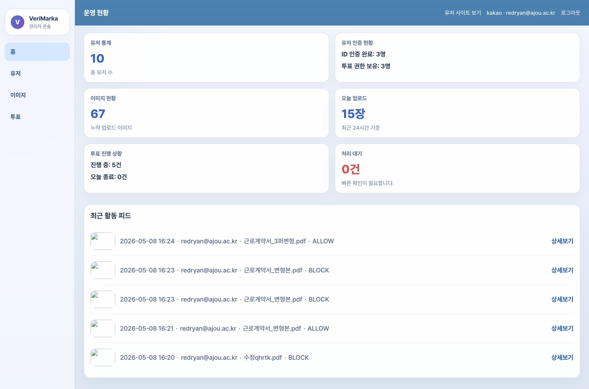
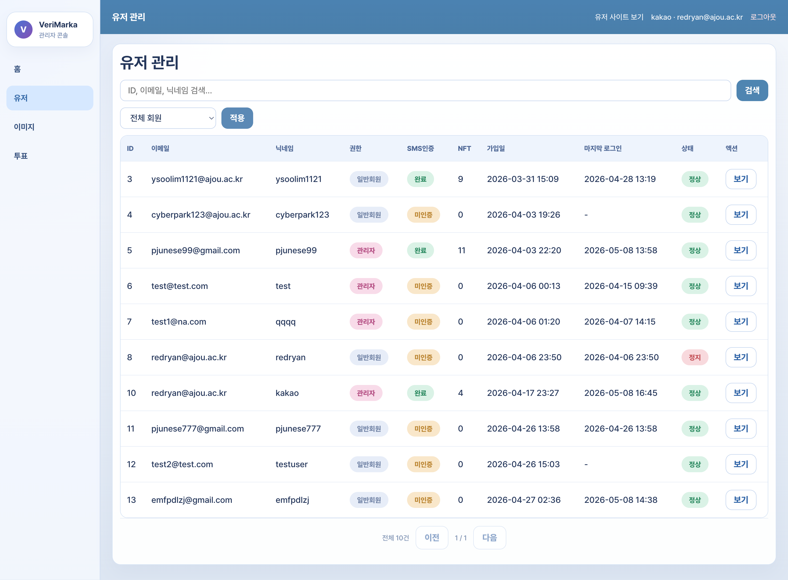
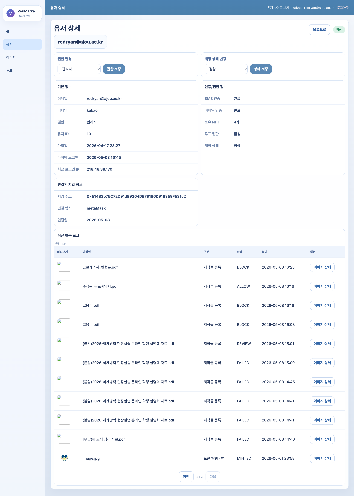
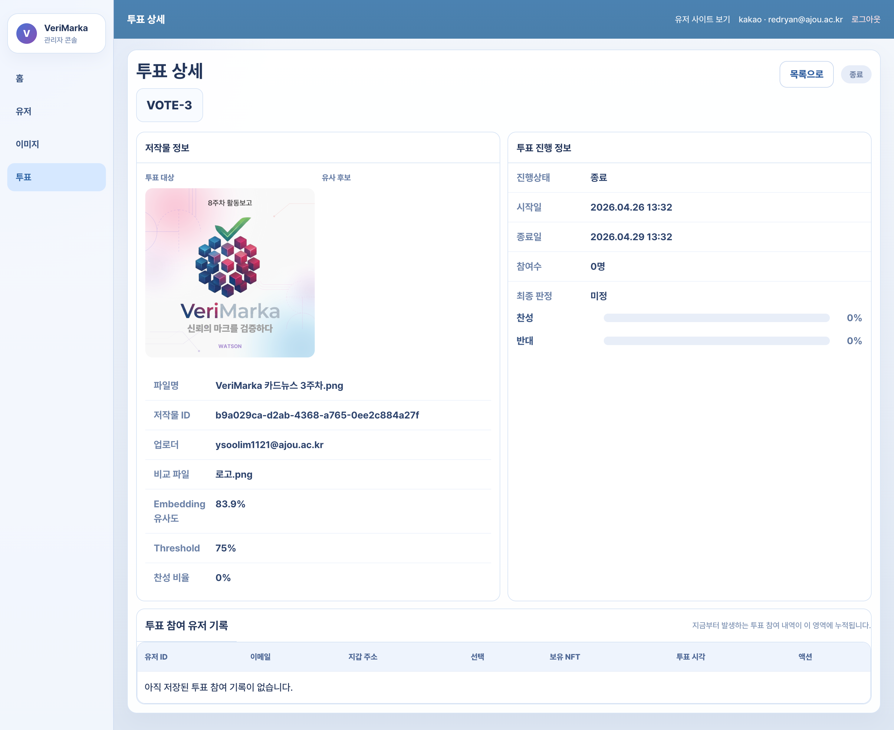
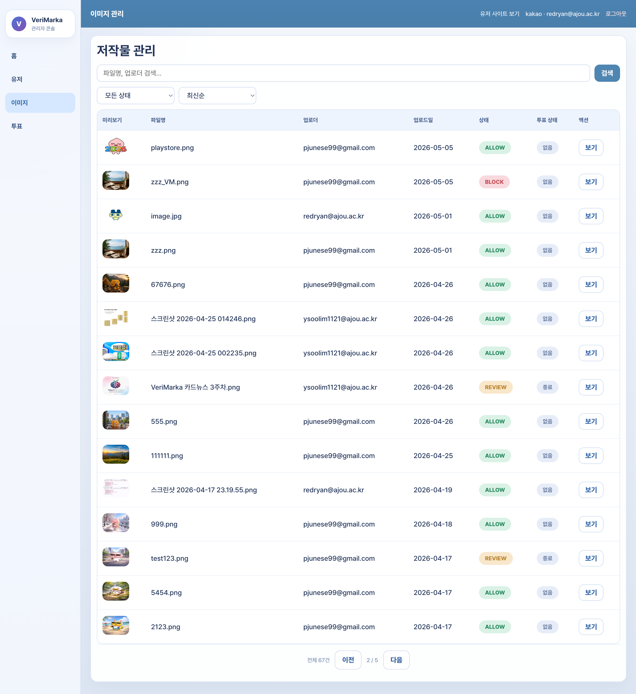

# Verimarka Admin Frontend

사용자, 저작물 등록/검증 기록, REVIEW 투표, 운영 오류를 관리하기 위한 Verimarka 관리자 React 프론트엔드입니다.

기존 개발/운영 인수인계 문서는 [HANDOFF.md](./HANDOFF.md)에 보존했습니다.

## 1. 프로젝트 한 줄 소개

Verimarka Admin은 운영자가 사용자 인증 상태, 저작물 판정 결과, 투표 진행 상황, 관리자 조치 이력을 빠르게 확인하고 대응할 수 있도록 만든 별도 관리자 콘솔입니다.

## 2. 개발 배경

AI 저작물 등록 서비스는 사용자 화면뿐 아니라 운영자가 인증, 등록 기록, 투표 상태, 오류 로그를 확인할 수 있는 별도 관리 화면이 필요합니다. 관리자 프론트엔드는 서비스 운영 중 발생하는 사용자/콘텐츠 상태를 빠르게 파악하고, 이후 권한 관리와 감사 로그 기능을 확장할 수 있는 기반으로 구축했습니다.

## 3. 주요 기능

| 영역 | 기능 |
| --- | --- |
| 인증 | 관리자 이메일 로그인, Google/Kakao/Apple 관리자 OAuth callback, 토큰 갱신 |
| 대시보드 | 전체 사용자, 인증 완료 사용자, 투표 권한 사용자, 등록 콘텐츠, 진행 중 투표 지표 |
| 사용자 관리 | 사용자 목록 검색/필터, 상세 조회, 역할/상태 변경, 인증/지갑/NFT 정보 확인 |
| 저작물 관리 | 이미지/문서 목록, 상태/정렬 필터, 원본/워터마크/비교 후보 상세 |
| 투표 관리 | 투표 목록, 상태/정렬 필터, 찬반 비율, 참여자 기록, 연결 저작물 확인 |
| 운영 관측 | request id 기반 API 로그, Sentry browser 연동, 백엔드 response id 추적 |
| 배포 | 사용자 프론트와 분리된 `admin.verimarka.com` 정적 배포, Nginx, GitHub Actions |

## 4. 기술 스택

| 구분 | 사용 기술 |
| --- | --- |
| Frontend | React 19, TypeScript, Vite |
| Routing | React Router 7 |
| API | Django REST API, JWT, cookie refresh |
| State/Data | 커스텀 resource hook, fetch wrapper, pagination/filter query |
| Observability | request id logger, Sentry browser bundle |
| Build/Deploy | TypeScript build, Vite build, GitHub Actions, rsync, Nginx |
| Infra | `admin.verimarka.com`, Let's Encrypt, Docker/Nginx 운영 환경 |

## 5. 아키텍처

| 구분 | 이미지 | 설명 |
| --- | --- | --- |
| 전체 구조 |  | 사용자 프론트와 분리된 관리자 정적 앱이 동일한 Django API를 바라보는 구조입니다. |

## 6. 관리자 화면

| 화면 | 캡처 | 설명 |
| --- | --- | --- |
| 대시보드 |  | 핵심 운영 지표와 최근 사용자/콘텐츠/투표 상태를 요약합니다. |
| 유저 목록 |  | 사용자 검색, 인증 상태, 권한, 계정 상태를 표로 확인합니다. |
| 유저 상세 |  | 사용자 기본 정보, 인증/지갑 정보, 최근 활동, 상태 변경을 한 화면에서 처리합니다. |
| 투표 상세 |  | 투표 대상/비교 후보, 찬반 비율, 참여자 기록을 확인합니다. |
| 파일 목록 |  | 등록된 이미지/문서의 판정 결과, 투표 상태, 업로더 정보를 조회합니다. |

## 7. 역할 분담

| 이름 | 역할 |
| --- | --- |
| 박준서 | AI 모델/분석 담당 |
| 박민정 | 관리자 프론트엔드, 백엔드 관리자 API 연동, 배포/운영 흐름 담당 |
| 임윤수 | 블록체인 컨트랙트/연동 담당 |

## 8. 기술적으로 고민한 점

| 고민 | 해결 방향 | 구현 포인트 |
| --- | --- | --- |
| 사용자 서비스와 관리자 서비스를 분리하되 API 계약은 공유해야 함 | 관리자 앱을 별도 Vite 프로젝트로 두고 `/api` proxy와 운영 Nginx 경로를 통일 | 로컬 포트는 `4173`, 사용자 프론트는 `5173`으로 분리해 개발 충돌을 줄임 |
| 운영자는 빠르게 스캔할 수 있는 정보 밀도가 필요함 | 대시보드, 목록, 상세, 상태 pill, 필터 중심의 테이블 UI 구성 | 카드형 홍보 화면보다 검색/필터/페이지네이션/상세 이동을 우선 |
| 관리자 URL 파라미터는 임의 조작 가능성이 있음 | UUID/양의 정수 파라미터를 정규화한 뒤 API 호출 | 잘못된 URL은 API 요청 전에 404/403 화면으로 분기 |
| 관리자 토큰 만료 시 작업 중인 화면이 끊길 수 있음 | access token 만료 시 refresh 후 원 요청 재시도 | 실패 시 로그인 화면으로 복귀하고 request id를 남김 |
| 운영 오류를 백엔드와 함께 추적해야 함 | `AdminApiError`에 status, request id, response id, path를 포함 | Sentry context에도 동일 값을 넘겨 백엔드 로그와 맞춰볼 수 있게 구성 |
| 추후 권한/감사 로그 확장이 필요함 | 사용자 role/status 변경 UI와 API 구조를 먼저 분리 | 현재는 기본 관리자 기능을 제공하고, 활동 로그 저장/IP 제한/세부 권한 분리를 확장 포인트로 정리 |

## 9. 트러블슈팅 / 성과

| 문제 | 원인 | 해결 |
| --- | --- | --- |
| 사용자 프론트와 관리자 프론트 개발 서버 포트 충돌 | 두 앱 모두 Vite 기본 포트를 사용하면 동시에 띄우기 어려움 | 관리자 앱 포트를 `4173`으로 고정하고 API proxy만 동일하게 유지 |
| 상세 페이지에서 잘못된 id로 API가 호출됨 | 라우터 파라미터가 문자열 그대로 API path에 들어감 | UUID/숫자 파라미터 정규화 유틸을 두어 잘못된 값은 요청하지 않도록 처리 |
| 관리자 API 실패 시 원인 확인이 어려움 | 화면에는 일반 오류만 보이고 백엔드 로그와 연결할 키가 부족함 | 모든 관리자 요청에 `X-Request-Id`를 부여하고 응답의 `X-Response-Id`를 에러 객체/Sentry에 저장 |
| 대량 목록 화면에서 운영자가 원하는 항목을 찾기 어려움 | 전체 데이터를 단순 표로만 표시 | 검색어, 상태 필터, 정렬, 페이지네이션을 목록별로 구성 |
| 배포 실패 시 관리자 화면이 빈 페이지가 될 수 있음 | 정적 `dist` 교체 중 실패 가능성 | GitHub Actions/rsync/Nginx reload 흐름과 직전 빌드 복원 전략을 정리 |

## 10. 실행 방법

실행 방법은 [docs/SETUP.md](./docs/SETUP.md)를 참고하세요.
