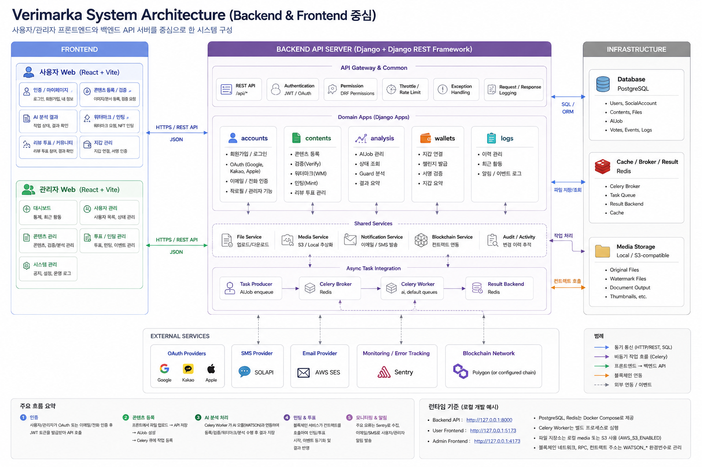
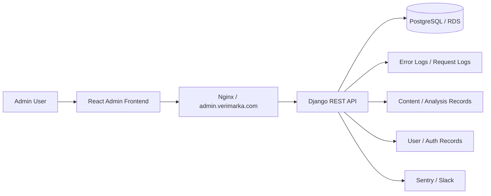

# Verimarka Admin Frontend

사용자, 저작물 등록/검증 기록, 운영 오류를 관리하기 위한 Verimarka 관리자 React 프론트엔드입니다.

기존 개발/운영 인수인계 문서는 [HANDOFF.md](./HANDOFF.md)에 보존했습니다.

## 1. 프로젝트 한 줄 소개

Verimarka는 AI 생성 이미지의 저작권 등록 가능성을 분석하고, 워터마크와 NFT 발급을 통해 저작물의 소유 및 검증 기록을 남기는 서비스입니다.

## 2. 개발 배경

AI 저작물 등록 서비스는 사용자 화면뿐 아니라 운영자가 인증, 등록 기록, 투표 상태, 오류 로그를 확인할 수 있는 별도 관리 화면이 필요합니다. 관리자 프론트엔드는 운영 중 발생하는 사용자/콘텐츠 상태를 빠르게 파악하고, 이후 권한 관리와 감사 로그 기능을 확장할 수 있는 기반으로 구축했습니다.

## 3. 주요 기능

- 관리자 로그인 화면 및 인증 흐름
- 관리자 페이지 기본 레이아웃
- 사용자 관리 화면 기반
- 등록/분석 기록 관리 화면 기반
- 저작물 등록 및 검증 상태 확인 화면 기반
- 운영 오류 로그 확인 기반
- 사용자 프론트와 분리된 `admin.verimarka.com` 배포 구조
- 관리자 프론트 전용 GitHub Actions 자동 배포
- 관리자 정적 파일 배포, 헬스체크, 실패 시 복원 전략

## 전체구조 및 백엔드 구조

## 4. 기술 스택

- Frontend: React 19, TypeScript, Vite
- Routing: React Router
- API: Django REST API 연동
- Build/Deploy: TypeScript build, Vite build, GitHub Actions, rsync, Nginx
- Infra: `admin.verimarka.com`, Let's Encrypt, Docker/Nginx 운영 환경

## 5. 시스템 아키텍처 그림

## 6. 역할 분담
- 박준서: AI 담당
- 박민정: 웹 풀스택 담당
- 임윤수: 블록체인 담당

## 7. 기술적으로 고민한 점

- 사용자 서비스와 관리자 서비스를 분리해 배포하면서도 같은 백엔드 API를 안정적으로 바라보도록 Vite proxy와 운영 Nginx 경로를 정리했습니다.
- 관리자 프론트는 운영 도구이므로 화려한 화면보다 기록 조회, 상태 확인, 장애 대응에 필요한 정보 구조를 우선했습니다.
- 운영 배포에서 `dist` 동기화, Nginx reload, 헬스체크 중 하나라도 실패하면 이전 빌드로 되돌릴 수 있도록 복원 전략을 검토했습니다.
- `admin.verimarka.com`은 공개 도메인이므로 추후 Cloudflare 또는 Nginx 기반 IP 제한, 관리자 권한 분리, 관리자 활동 로그 저장이 필요하도록 정리했습니다.

## 8. 트러블슈팅 / 성과

- 사용자 프론트와 포트가 충돌하지 않도록 관리자 개발 서버 포트를 `4173`으로 분리했습니다.
- 운영 compose의 Nginx 정적 파일 경로와 관리자 프론트 배포 경로를 맞춰 `admin.verimarka.com` 뼈대를 구성했습니다.
- 관리자 프론트 배포 실패 시 직전 `dist` 백업본으로 복원하는 흐름을 정리해 운영 배포 리스크를 줄였습니다.
- 관리자 오류 로그 기반을 추가해 운영 중 사용자 이슈를 추적할 수 있는 출발점을 만들었습니다.

## 9. 실행 방법

실행 방법은 [docs/SETUP.md](./docs/SETUP.md)를 참고하세요.
